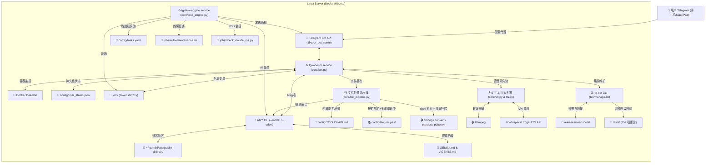

# 🚀 Linux 系统 Telegram 智能监控与 AGY 智能体系统架构文档

> **项目状态**: ✅ 生产环境已部署并稳定运行  
> **服务名称**: `tg-monitor.service` | `tg-task-engine.service`  
> **宿主环境**: Linux (Debian/Ubuntu Server)  
> **核心引擎**: Google Antigravity CLI (`agy`) & pyTelegramBotAPI & APScheduler

---

## ⚠️ 核心依赖说明 (Prerequisites)

本项目深度依赖 **Google Antigravity CLI (`agy`)** 作为核心 AI 推理引擎。在进行任何部署前，请确保您的服务器已成功安装并配置了 `agy`，并且可以在终端全局调用。
若无此环境，机器人的大脑将无法运作！

---

## 📐 系统整体架构图



---

## 🌟 核心功能特性一览

### 1. 📊 服务器硬件与 Docker 容器监控
- **系统健康诊断**: 动态获取 CPU 使用率、5分钟负载、内存占用、系统磁盘 (/) 剩余空间及多品牌 CPU 传感器温度（兼容 Intel `coretemp`、AMD `k10temp`/`zenpower` 及 ARM `cpu_thermal`）。
- **Docker 容器全控**: 监控全部运行中 Docker 容器状态，内联按键支持 **一键实时查看最新 30 条日志** 与 **一键重启容器**。
- **Systemd 核心服务**: `/systemctl` 随时抽检 `tg-monitor.service`、`docker.service`、`ssh.service` 健康度。

### 2. 💬 沉浸式 AGY 对话、多模型与思考深度控制
- **沉浸 Chat 模式**: 点击 `💬 进入 AGY 对话` 后无需加 `/agy` 前缀，直接发文字即可人机协同。
- **AI 模型在线切换 (`/model`)**: 快捷按键 1-Click 动态切换模型 (`gemini-3.6-flash-high`, `gemini-3.1-pro-high`, `claude-sonnet-4-6`, `claude-opus-4-6-thinking`, `gpt-oss-120b-medium`)。
- **思考推理深度切换 (`/effort`)**: 可视化选择 Reasoning Effort (`low`, `medium`, `high`)。
- **智能退避与自动容错 (Auto-Fallback Retry)**: 若所选模型（如 Claude Opus/Sonnet）不支持 `--effort` 参数，系统在 0.1s 内自动拦截 `invalid model selection` 异常并自动剥离 `--effort` 重试，Telegram 前端零报错顺畅应答。
- **参数卡片查看 (`/settings` / `/state`)**: 可视化查看当前会话绑定的模型、思考深度及 Conversation ID。
- **Telegram 原生 Typing 状态**: AI 推理期间，Telegram 顶栏持续 4 秒循环守护 `typing...` 状态。
- **MarkdownV2 渲染**: 集成 `telegramify-markdown`，格式化呈现精美标题、加粗文本、引用框及黑框代码高亮。
- **多消息防抖合并 (1.5s Debounce)**: 用户连续快速发送的 2~3 条消息自动打包合并为单次深度 Prompt 提交。
- **多模态视觉 (Vision Analysis)**: 支持直接发送图片、错误截图，系统自动下载至 `/tmp` 并调用 `agy` 识别分析，完毕后自动清理。
- **转发消息 (Forward Origin) 解析**: 转发来自频道/群组的技术文章或代码报错，自动附加来源元数据供 `agy` 深度理解。
- **历史会话与内联分页**: 发送 `/history` 扫描 `brain/` 日志提取历史提问作为标题，支持 `[◀️ 上一页] [📄 1/3] [下一页 ▶️]` 原地无感翻页与一键恢复。
- **双向语音引擎 (STT & TTS)**:
  - **听觉 (STT)**: 用户直接发送语音，自动触发 Whisper 大模型转录，并无缝进入 AGY 分析。环境嘈杂失败时自动提示。
  - **视觉 (TTS)**: 提供 Edge-TTS 自动文字转语音播报，发送 `/voice` 开关。自动识别过滤代码块等非朗读内容。支持 1000 字长文本朗读。
  - **容错降级**: 自动采用 FFmpeg 处理所有生僻格式与采样率。生成失败时无感降级为纯文本，保障 100% 连贯性。

### 3. 🗂️ 智能文件处理流水线 (`core/file_pipeline.py`)

直接把文件丢给机器人并说人话即可 —— "压缩一下"、"上下拼接"、"转成 gif"、"转 PDF"。

- **意图分流**: 关键词短路优先判定"物理处理"还是"视觉问答"，常见措辞**零模型调用**；
  只有真模糊时才问一次轻量模型。无附言一律走问答（非破坏性默认）。
- **相册聚合**: Telegram 相册的每张图是独立消息，按 `media_group_id` 聚合成**单次任务**，
  多图拼接才成为可能。
- **文件与文字合并**: 无论"先发图后打字"、"转发+评论"（评论先到），还是文字在**文件下载
  期间**到达，都会合并成单次请求，不会产生两条互不相干的回复。
- **Planner-Executor 隔离**: 模型只拿到元数据（路径、大小、分辨率/时长/页数）与需求，
  输出纯命令数组；Python 负责执行。菜谱与工具链由代码按扩展名+关键词命中后**直接内联**，
  不让模型自己去搜。
- **错误回喂重规划**: 命令失败时把**真实 stderr** 回喂给 Planner 修正，而不是丢一个返回码。
  "命令全绿但没产物"同样视为失败。产物落错目录会被自动回收。
- **按类型投递**: gif → 动图、视频 → 视频、音频 → 音频；图片走 document 保真
  （send_photo 会二次压缩，那会抵消压缩任务的意义）。
- **安全收敛**: 外部文件名先经 `safe_filename()` 中和 shell 元字符 —— 路径会原样进入
  执行的命令，不收敛即构成命令注入。

> 架构演进过程与责任边界速查表见 `ARCHITECTURE.md`。
> 新增菜谱需同时写 `.md` 并在 `RECIPE_INDEX` 中注册，详见 `config/file_recipes/README.md`。

### 4. 🧪 四级发布闸门 (`tests/`)

`tg-bot test` 依次执行，全绿才允许发布；`tg-bot restore` / `upgrade` 也会自动调用：

| 级别 | 内容 |
|---|---|
| `[1/4]` | 语法预检（扫描 `core/` 与 `jobs/` 全部 Python 文件） |
| `[2/4]` | **业务逻辑单元测试**（`tests/run_all.py`，257 项断言，零外部依赖） |
| `[3/4]` | Telegram API 联调探针 |
| `[4/4]` | AGY 引擎底层探针 |

语法通过不代表行为正确 —— `[2/4]` 才是挡住"改坏了但还能跑"的那道闸。

### 5. ⏱️ 声明式动态任务调度引擎 (`core/task_engine.py` & `config/tasks.yaml`)
- **纯任务声明配置**: `tasks.yaml` 仅定义任务逻辑与调度时间，不涉及任何凭证。通知推送凭证由 `.env` 环境变量直接供给。
- **无感热加载**: Python `TaskEngine` 持续监听配置表，改动即生效，无需重启进程。
- **编辑容错与防抖**: 引入 2 秒写入防抖机制。编辑中途格式错乱或语法未完成时，引擎**自动忽略非法变更并保持上一次稳定配置**，拒绝崩溃。

### 6. 🧰 幽灵文件消除与一键自救快照工具箱 (`tg-bot`)
- **动态版本构建 (Dynamic Versioning)**: `VERSION` 基于代码文件最后修改时间戳自动计算（如 `v2026.08.02-1012`），彻底消除写死的静态版本号。
- **精简快照命名 (`snap_YYYYMMDD_HHMM[_tag].tar.gz`)**: 一键生成包含 `core/`、`config/`、`jobs/`、`bin/`、`tests/`、`install.sh` 及 `requirements.txt` 的轻量快照包（保存至 `releases/snapshots/`）。
- **幽灵文件消除机制**: 还原前先校验压缩包完整性 (`tar -tzf`)，通过后自动清空受控子目录 (`core/`, `config/`, `jobs/`, `bin/`, `tests/`)，确保解压后快照之后新增的幽灵文件/坏代码被 100% 抹除。
- **选择性还原与自救 (`tg-bot restore` / `tg-bot rescue`)**: 一键解压还原，自动跑沙箱四级校验并重启服务。
- **永久保留快照机制**: 若生成的快照文件名中包含 `keep` 关键字，该快照将被视为“免死金牌”，永久存活，不受 20 个快照上限的滚动清除限制。

### 7. 🚀 一键部署与解耦迁移 (`install.sh` & `.env`)
- **配置解耦**: Token、Admin ID、代理配置统一收敛到 `.env`，原生支持 Git 开源脱敏。
  **systemd unit 只负责拉起进程，不承载任何配置** —— 避免 `.env` 与 unit 两个真相源。
- **一键部署**: `./install.sh` 幂等可重复执行，自动完成：
  安装系统工具链（ffmpeg / imagemagick / pngquant / pandoc / poppler-utils，
  使用 `--no-install-recommends` 避开图形栈）→ 创建 venv 与依赖 → 检查 agy →
  生成 systemd unit 与 `tg-bot` 软链 → 沙箱四级校验通过后才启动服务。
- **部署审计 (`./install.sh --check`)**: 只读检查工具链、agy、venv、`.env`、
  **unit 是否与脚本定义漂移**、软链、运行时特权与沙箱校验，不改动任何东西。
- **不要求改造你的环境**: 不写入 `/etc/sudoers.d`。运行时重启走三档降级 ——
  免密 sudo → 交互式 sudo → **无特权方案**（结束自身进程，由 `Restart=always` 拉起）。
- **已在干净 Debian 13 容器中端到端验证**：工具链实跑、unit 与软链正确生成、
  测试套件在裸环境通过、配置错误时正确中止部署。

---

## 🛠️ 运维与自救工具命令速查表

在终端中直接使用 `tg-bot` (即 `bin/manage.sh`) 命令：

```bash
# 📸 自救与快照指令
tg-bot backup [tag]     # 手动创建当前系统的完整打包快照 (保存至 releases/snapshots/snap_*.tar.gz)
tg-bot backups          # 列出所有历史快照还原点
tg-bot restore [name]   # 还原指定快照 (自动预检压缩包 + 清理幽灵文件 + 恢复 + 重启)
tg-bot rescue           # 🚨 一键自救！服务崩溃时自动诊断并还原最新稳态快照

# ⚙️ 基础运维指令
tg-bot version          # 查看机器人当前运行版本 (基于修改时间的动态版本号)
tg-bot status           # 查看机器人与动态任务引擎服务状态
tg-bot state            # 查看 Telegram 用户的当前 Chat 模式与绑定的会话 ID
tg-bot test             # 沙箱 4 级校验 (语法、单元测试、Telegram API、AGY 引擎)
./install.sh --check    # 审计当前部署 (工具链/agy/unit 漂移/软链/sudo/服务)
tg-bot upgrade <file>   # 自动快照 ➔ 校验新代码 ➔ 部署重启 ➔ 失败自动恢复
tg-bot maintain         # 手动立即触发运行每周自动维保任务
tg-bot tts "文本"       # 运行两阶段独立 TTS 语音生成与转码测试
tg-bot stt <文件>       # 运行两阶段独立 STT 语音识别测试
tg-bot logs             # 实时查看机器人运行日志 (Ctrl+C 退出)
tg-bot restart          # 重启所有关联服务
tg-bot edit             # 使用 nano 编辑 core/bot.py 源码
```
